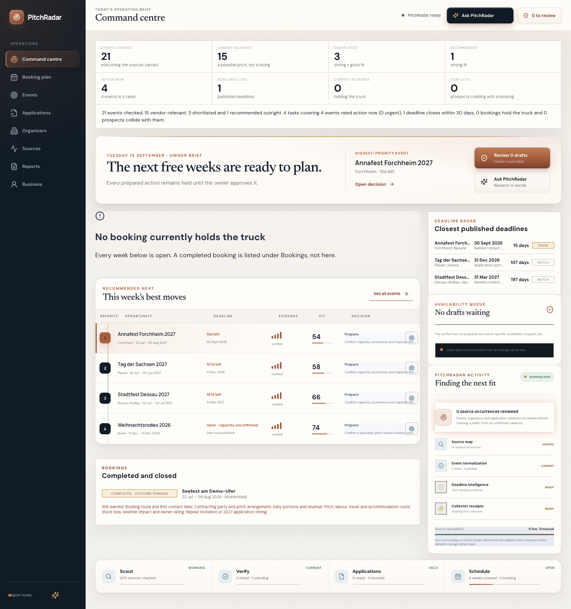
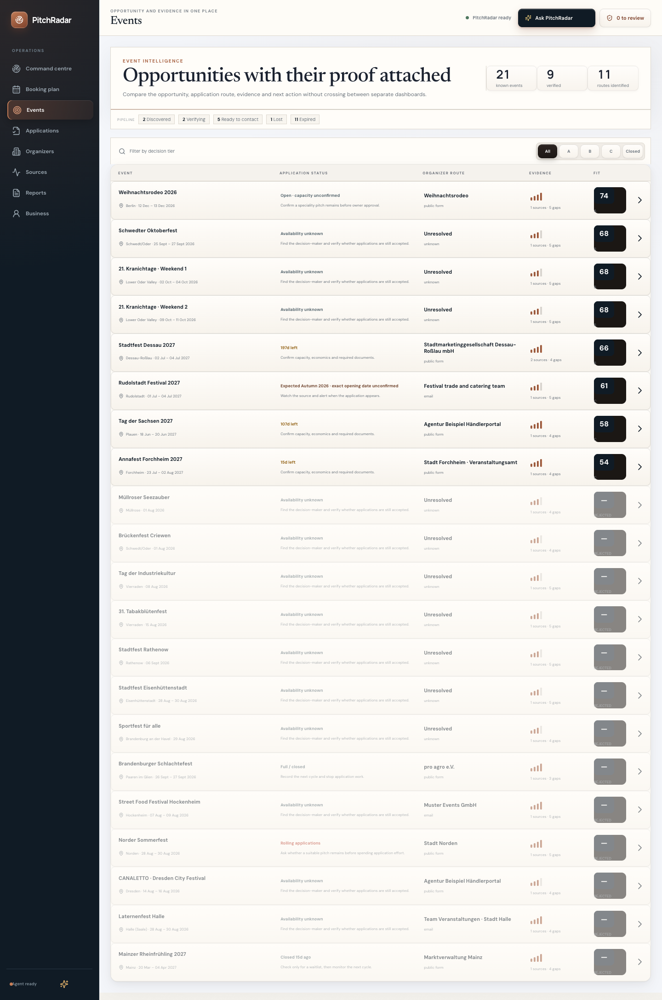
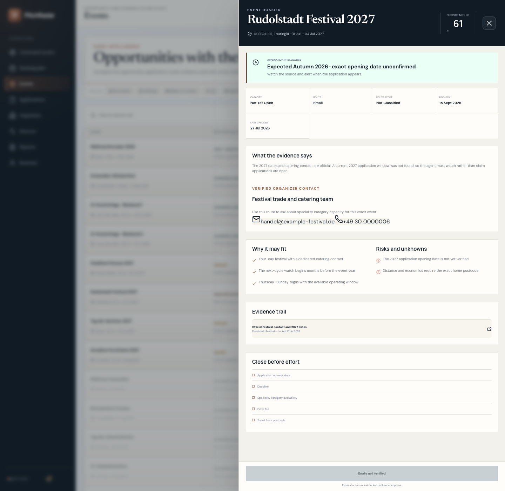
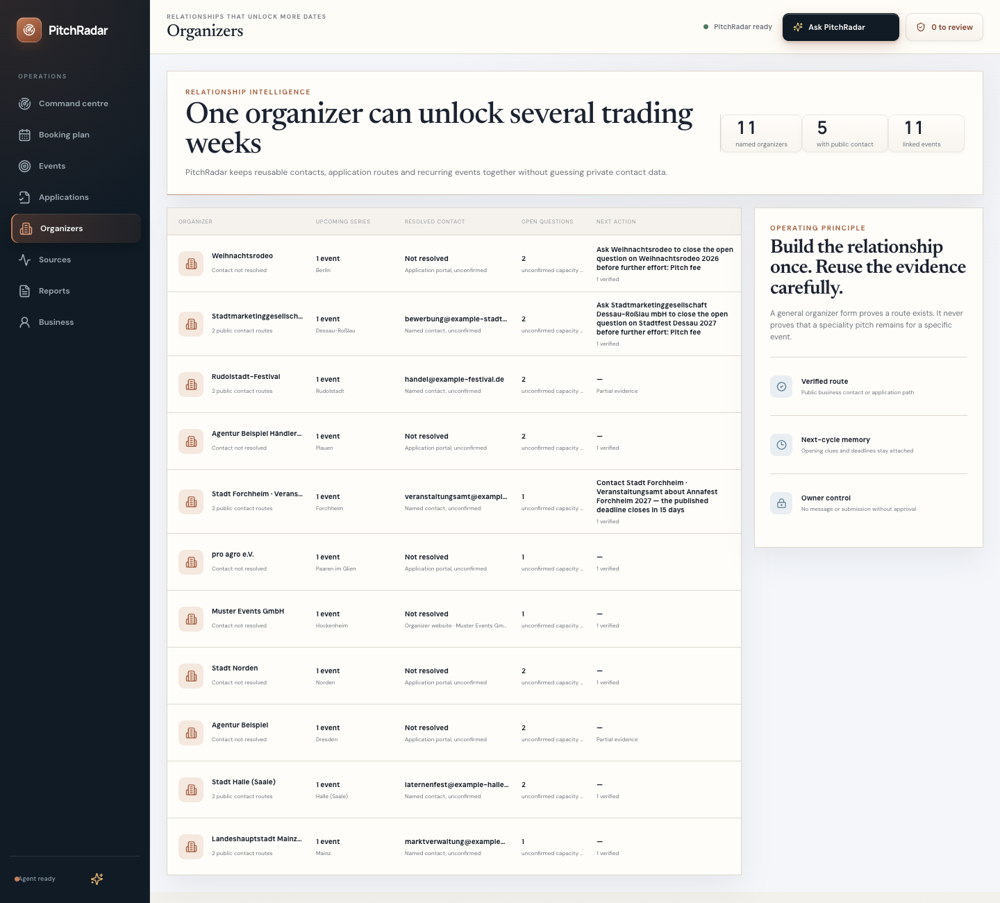
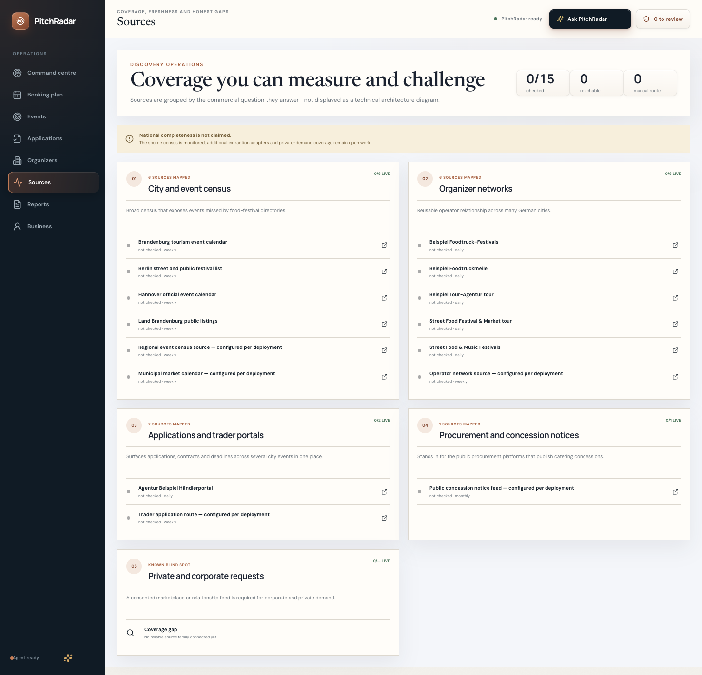
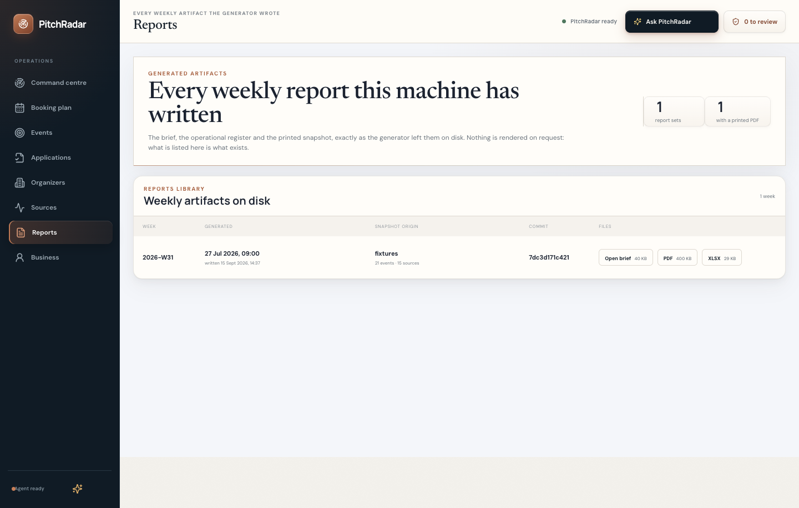

# PitchRadar

Commercial-opportunity intelligence for mobile food vending in Germany — a multi-agent pipeline with a deterministic core, a language model only where rules cannot answer, and evaluation, replay, receipts and reporting treated as engineering rather than afterthoughts.

## The problem

A mobile food vendor lives or dies by which events they trade at. Germany runs thousands of Stadtfeste, Volksfeste, street-food tours, Christmas markets and municipal market days a year, and for each one the vendor has to answer a chain of questions before the application window shuts: does this event exist in a week I can work, who actually controls the food pitch (the city? the principal organizer? a zone operator? a trader portal?), is the application open, when does it close, is there still room for my category, and is the whole thing worth the drive.

Almost none of that is queryable. The event exists on a municipal calendar that answers "where and when" for every public happening in the city — church tours and planetarium shows arrive in the same feed, in the same shape, as the Stadtfest. The pitch is controlled by a company the event page does not name. The deadline is on a different page, or on no page at all. By the time a human has checked twenty organizers by hand, the good windows have closed. That is the gap PitchRadar closes: it collects, deduplicates, qualifies, scores, resolves the route to a named human, watches the deadlines, and hands the owner a short weekly list of what to do — with the evidence behind every claim.

## What it does

Public sources are collected on a cadence and stored as immutable raw occurrences with a receipt; extractors turn each source family's own format (Tribe Events API, JSON-LD, iCalendar, several HTML shapes) into typed occurrences; the normalizer folds occurrences into canonical events with a measured-threshold dedup; a vendor-relevance gate separates real vending opportunities from consumer-calendar noise; deterministic scoring ranks what is left against the operator's travel radius, trading days and week occupancy; an organizer-intelligence stage resolves the application route down to a named contact and content-hashes the page it read; a deadline monitor keeps three-state evidence for every application window and raises threshold alerts; weather enrichment attaches a forecast to near-term events without touching the score; and the weekly reporting stage renders the same snapshot into three layers, ending at an owner approval step that never sends anything on its own.

The agent roster, each one a boundary with its own receipts:

| Agent | Responsibility |
| --- | --- |
| **Discovery** | Runs enabled sources by cadence; bounded requests; classifies each source reachable / restricted / broken / degraded / unavailable; writes an immutable `source_runs` receipt. |
| **Extraction** | One shipped extractor per source family — Tribe API, JSON-LD, ICS, and dedicated HTML adapters — producing typed occurrences with a content hash. |
| **Qualification** | Normalization, cross-source dedup, and the vendor-relevance gate that decides `relevant` / `irrelevant` / `unclear`; then deterministic fit scoring. |
| **Contact Resolver** | Follows the discovery graph to the party that actually controls the pitch, then reads what German sites are legally obliged to publish — application page, site root, `/impressum`, `/kontakt` — for a named human, an organizer-domain address and a phone. Verifies only fields still present on the official page; stores the matched phrase, the page and a content-hashed check receipt, including the negative one. |
| **Deadline Monitor** | Maintains three-state deadline evidence and idempotent alerts at 30 / 14 / 7 / 2 days. Counts due windows; never fetches. |
| **Weather Enricher** | City-precision forecast for events inside the forecast window, stored with its request URL and raw daily arrays. Score-neutral by test. |
| **Reporting** | Builds the week's decision brief, operational register and evidence sheets from one deterministic snapshot. |

Above them sits an owner-facing command agent with thirteen tools, a per-turn injection guard and a proposal-only external-action boundary (below).

## Real-world status

PitchRadar runs as a privately deployed single-operator system (daily collection cycles, nightly restore-verified backups). This repository is the sanitized engineering core: client identity, deployment infrastructure and the full curated source registry are removed.

## Engineering highlights

**Deterministic dedup with measured thresholds — and a real defect it caught.** Cross-source dedup scores candidate pairs on city, date and normalized name and merges at or above 0.65. German event names write the same compound both ways, and the token comparison cannot see inside a word: "Street Food Drink & Music Festival Sankt Augustin" and "Streetfood Drink & Music Festival Sankt Augustin" scored **0.625** — just under the gate — and shipped as two separate opportunities in a real collection. The fix is a reverse-safe normalization that splits the compounds to their two-word form before tokenizing, so the rule never depends on which spelling a source happened to publish. The threshold was not moved to make the symptom go away. `server/normalizer.ts`, with the case pinned in `server/dedup.test.ts`.

**Three-state deadline evidence.** A null deadline used to mean two different things — "no deadline has been published yet" and "no deadline exists, applications are rolling" — and the product had been quietly treating them as one. `deadline_evidence` now distinguishes `published` / `not_found` / `none_rolling`, kept true on every pass, so the brief can say *which* kind of unknown it is holding. `server/deadline-monitor.ts`.

**Score-neutral weather enrichment.** Weather is display and alert only: it activates solely inside the forecast window, it never reaches the ranking code, and `server/weather.test.ts` asserts that scoring is byte-identical with and without a forecast attached. Coordinates are city-precision and the record says so, because a city centroid is not a pitch location.

**A vendor-relevance gate born from a real noise incident.** Municipal census feeds delivered guided church tours and museum exhibitions into the opportunity list, and — because the normalizer defaults an unrecognised occurrence to `street_food` — the stored category was evidence of nothing. The gate is an ordered keyword rule with a deliberate asymmetry: a strong market/food token wins even against a red-herring venue word ("Museumsfest" is an opportunity; the museum is the venue), a weak token does not beat an irrelevant one ("Regionalliga" is football), and nothing matching yields `unclear` — an honest verdict that is ranked down and tagged, never silently dropped. `server/vendor-relevance.ts`, 61 cases.

**Three-layer reporting from one snapshot.** The same deterministic snapshot renders as (1) a 60-second **decision brief** — act now, top opportunities, deadline radar — (2) a full **operational register** workbook covering every non-irrelevant event in the snapshot, and (3) **evidence sheets** inside that workbook, where sources, drafts and system QA can be sorted instead of scrolled. Nothing in the generator reads the network or any clock other than `--now`: the brief HTML is byte-identical across reruns, and the workbook is content-identical — its cells, sheets and formatting are reproduced exactly, while the zip container's per-file metadata varies between runs, so the `.xlsx` bytes are not stable and are not claimed to be. See [`reports/sample/`](reports/sample/).

**An impressum-grounded contact resolver that would rather return nothing.** "Application portal, unconfirmed" is true and useless. German commercial and municipal sites are legally obliged to publish an Impressum, so for most organizers a reachable human already sits on a public page — it was simply never read. A dedicated cycle stage fetches at most four pages per event through the same SSRF-guarded reader the collector uses (application page, site root, `/impressum`, `/kontakt`; pages shared between events are read once, under a per-run fetch budget) and extracts *deterministically*, under four rules: nothing is invented, and every stored field carries the page, the timestamp and the phrase that established it; a bare name is not a contact — a name counts only where a role word is punctuated as a label, so sponsors, streets and photographer credits are dropped; an address on the page is not the organizer's address, so agency and hosting mailboxes are rejected while subdomains of the organizer's own host are kept; and the negative result is a result, stored as "no public contact found on &lt;url&gt;" rather than silence. Four defects were *measured* on the live corpus and fixed before any row was kept — a nav label stored as a person, an event-date run stored as a phone number, a company name truncated into a person by its own capital letter, and a later page erasing an earlier page's evidence — each pinned by a regression test. The whole stage is read-only GETs, so it contributes zero external actions. `server/contact-resolver.ts`, 24 cases.

**Fit scores what is known; confidence scores how solid it is.** The original scheme made one mistake twice: a fact not yet gathered was deducted from the score *and* counted against confidence, so a freshly discovered event could not reach the top band however well it fit, and confidence measured the length of the to-do list rather than the strength of the evidence. Across 283 live events that produced 0 STRONG / 1 GOOD and 276 rows labelled LOW confidence — a distribution that ranks nothing. Fit now scores only what is known (event type, calendar fit across every trading day, region, trading duration, application window) with evidence *adding* on top (sourced visitor numbers, a known pitch fee); the missing-fields deduction is gone, as is the deduction for a "risk signal" that merely recorded an open question — `isOpenQuestionRisk` separates the two, and open questions are printed under KEY UNKNOWNS instead of being charged. Confidence now states a basis a reader can check: an official source and a reachable organizer, or an aggregator listing with no corroboration. Bands were measured against the resulting distribution, not guessed: `TIER_BANDS` sits at 72/62, both inside real gaps in the live spread. The same corpus goes from 0/1/282 to 1/109/173 on fit and 0/7/276 to 4/49/230 on confidence — and the remaining LOW rows now say *why*, which is a fact about our sourcing rather than about the events. `src/ranking.ts`.

**Tests as infrastructure.** 626 tests across 45 files, including a **replay harness** that runs seven on-disk captured bodies through the real shipped extractors with a pinned clock and diffs the *whole* output — count and every field of every occurrence — against checked-in expectations, so an adapter edit cannot quietly drop a field nobody wrote an assertion for. Alongside it, **90 golden eval cases across 8 suites** (calendar, deadline, dedup, gating, retrieval, routing, SSRF, turn) run against the real agent code under enforced isolation: the runner refuses to start if a database URL is set, points the runtime at a throwaway directory, and clears the model key so no case can spend budget or go nondeterministic. That isolation is enforced rather than documented because its first version was not isolated — `dotenv` supplied the connection after the guard had passed and the first runs wrote into the live database.

**The approval boundary.** External action is proposal-only: `propose_external_action` creates a held proposal and never executes, approval records `approved_waiting_connector`, and no delivery connector exists. A per-turn guard backs it — once any tool has touched the network in a turn, the three write tools refuse for the rest of that turn, so fetched page text can never seed an internal state change, a durable memory or an approval-queue entry. Both halves are covered end to end, including over the signed gateway route.

**Model use, receipted.** The language model handles ambiguous text and drafting only. Extraction, dedup, scoring, deadlines, weather and reporting are deterministic and testable without a key, every model call's token usage is written to `llm_usage` and enforced against a daily cap, and the reply says so out loud when the deterministic fallback is entered. See [`docs/architecture.md`](docs/architecture.md#model-use-boundary).

## Product screenshots

The product itself, captured through the running UI at 1440px — no mockups, no
retouching, no cropping. Every one of these is the real interface rendered over
the **sanitized demo fixture snapshot** that ships in this repository: the
organizers, events, contacts and domains on screen are invented for publication.
The workflow reads in order.

### 1 · The command centre answers "what do I do today?"



Eight counts across the top, the owner brief beneath them, this week's best
moves ranked with their deadlines, and the deadline radar on the right — one
screen, no drill-down needed to know whether the week needs anything.

### 2 · Every opportunity carries its own proof



The pipeline strip counts what is discovered, verifying, ready to contact, lost
and expired. Each row shows the application status, the organizer route, how
many sources and how many gaps stand behind it, and the fit score — so a number
is never shown without what produced it.

### 3 · The dossier is where a decision is actually made



Application intelligence, the resolved organizer contact with the route it came
from, why it may fit, the risks and unknowns stated as unknowns, the evidence
trail, and the list of things to close before spending effort. The action button
stays locked: external actions remain proposals until the owner approves them.

### 4 · One organizer can unlock several trading weeks



Relationships rather than rows: each organizer keeps its resolved contact, its
open questions and the single next action that moves every event behind it. This
is the surface the report's organizer-task consolidation is built on — the same
grouping that turned 106 event cards into 7 tasks on the live corpus.

### 5 · The plan protects trading weeks, not leads


Twelve weeks, every week showing its primary, its credible backups and what is
still unverified — because the scarce resource is the week, not the lead.

### 6 · Coverage you can measure and challenge



Sources grouped by the commercial question they answer, each with its cadence and
its last check. National completeness is not claimed, and the known blind spot —
private and corporate demand — is listed as a blind spot rather than omitted.

### 7 · The reports library lists what exists on disk



Every generated week with its snapshot origin, the commit it was written from,
and the three artifacts themselves. Nothing is rendered on request: what the
list shows is what the generator actually left behind.

> The Applications view is not shown. It is a real view, but the demo fixture
> carries no prepared drafts, so it would only picture an empty queue; the
> Organizers screenshot above shows the same next-action work where the fixture
> has data.

## Weekly output

[`reports/sample/2026-W31/`](reports/sample/2026-W31/) holds a committed sample generated from the fixture snapshot at a pinned instant:

```
npm run report -- --now=2026-07-27T09:00:00+02:00 --out=reports/sample --fixtures --pdf
```

`pitchradar-brief-2026-W31.html` is the decision brief; `pitchradar-register-2026-W31.xlsx` is the operational register with the evidence sheets inside it; `pitchradar-brief-2026-W31.pdf` is the same brief printed to A4.

`--pdf` prints the brief with a Chromium that is **already on the machine** — the playwright cache, then `PUPPETEER_EXECUTABLE_PATH`, then an installed Google Chrome. Nothing is ever downloaded: where none of the three resolves, the run stops and names all three places it looked. The PDF keeps the brief's six internal section links, its evidence hyperlinks and an outline built from the headings, and its page count is read off the produced document rather than estimated from the HTML.

The print stylesheet is a density pass, not an abridgement: smaller type on tighter leading, the card sections flowed into two columns, every disclosure forced open. Same facts, same links, fewer sheets — the sample brief prints to **4 A4 pages** where it once took 8.

## Example output

[`examples/`](examples/) holds the same artifacts, named for what they are:

| File | What it is |
| --- | --- |
| [`weekly-brief-sanitized.pdf`](examples/weekly-brief-sanitized.pdf) | The printed decision brief — four A4 pages, live links, all six sections |
| [`opportunity-register-sanitized.xlsx`](examples/opportunity-register-sanitized.xlsx) | The operational register workbook, evidence and draft sheets included |
| [`sample-opportunities.json`](examples/sample-opportunities.json) | Twelve fixture events in the product's own `EventOpportunity` schema, scored by the real ranking code |

The PDF and the workbook are byte-for-byte the files in [`reports/sample/2026-W31/`](reports/sample/2026-W31/); the JSON is regenerated by `npx tsx scripts/export-sample-opportunities.ts` at a pinned instant and carries a top-level `demoData: true`.

All of it is demo data. The fixture catalogue is invented — invented organizers, invented events, invented contacts, and only `example-*` domains.

## Documentation

- [Architecture](docs/architecture.md) — the pipeline, the entity graph, and the model-use boundary
- [Local setup](docs/local-setup.md) — database, install, migrate, seed, test, report
- [Limitations](docs/limitations.md) — what this system does not do, stated plainly
- [What remains private](docs/what-remains-private.md) — what was removed from this repository and why
- [Case study](docs/case-study.md) — ten defects a real corpus found: symptom, root cause, fix, regression test
- [Agent operating model](AGENT_OPERATING_MODEL.md) — the product law the code enforces

---

License: all rights reserved — published as engineering proof.
