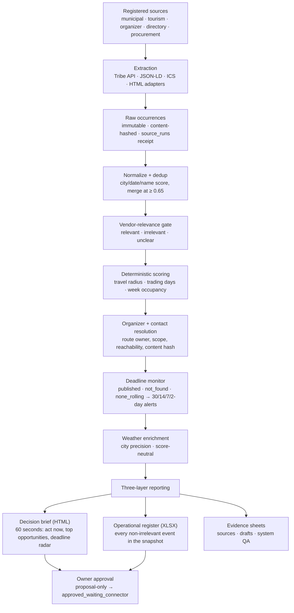
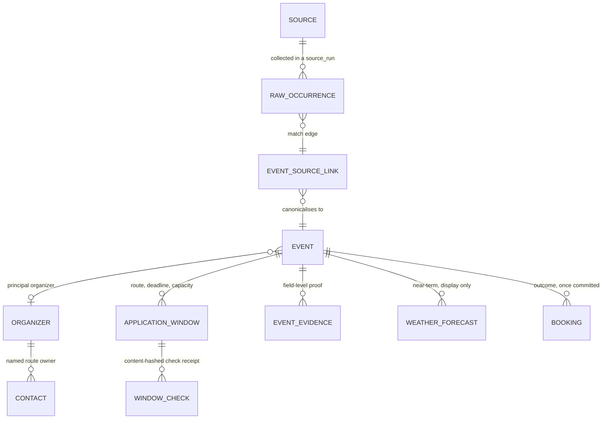

# Architecture

## The pipeline

Every stage is deterministic unless this document says otherwise. Each one writes a receipt, and the whole sequence runs as one idempotent cycle (`npm run cycle:scheduled`) behind a PostgreSQL advisory lock, so two overlapping runs cannot both collect.

Two properties of the diagram are load-bearing:

- **Raw occurrences are never edited.** Normalization writes canonical events beside them and links back; discovery stays auditable after the fact.
- **The pipeline ends at a proposal.** Nothing downstream of the owner's approval exists — see [Limitations](limitations.md).

## The entity graph

Discovery produces occurrences; the graph is what turns them into decisions. A raw occurrence is what one source said on one day. A canonical event is the thing itself, and the two are joined by typed, confidence-scored match edges rather than by overwriting.

- **`EVENT_SOURCE_LINK` carries `match_method` and `match_confidence`.** A merge is a recorded claim with a method and a number behind it, so a wrong merge can be found and reversed instead of being indistinguishable from a correct one.
- **`EVENT_EVIDENCE` is field-level.** Evidence supports *named fields* (`dates`, `city`, `organizer`, `food_zone`) with a publisher, an observed timestamp and a content hash — the mechanism that lets the brief show why it believes each claim.
- **`APPLICATION_WINDOW` separates route from capacity.** "A general organizer application route exists" and "a pitch in my category is still free at this event" are different facts with different evidence, and conflating them is the single most expensive error this domain offers. Capacity stays `unknown` until event-specific proof exists.

## Model-use boundary

The language model is used for exactly two things: reading ambiguous free text that rules cannot settle, and drafting prose for a human to approve. Everything a decision depends on is deterministic.

| Stage | Deterministic | Model |
| --- | --- | --- |
| Extraction (API / JSON-LD / ICS / HTML) | ✅ | — |
| Normalization and dedup | ✅ | — |
| Vendor-relevance gate | ✅ | — |
| Fit scoring and ranking | ✅ | — |
| Deadline evidence and alerts | ✅ | — |
| Weather enrichment | ✅ | — |
| Report rendering (all three layers) | ✅ | — |
| Ambiguous free-text interpretation in an owner turn | — | ✅ |
| Organizer / owner draft prose | — | ✅ |

Three guarantees hold that line:

1. **Receipted.** Every model call's token usage is written to `llm_usage` and enforced against a daily Europe/Berlin cap. Usage is a measured number, not an estimate.
2. **Fallback is audible.** With no API key, an exhausted cap, or a failed call, the deterministic core answers — and in the last two cases the reply says so explicitly rather than degrading silently.
3. **Model prose is never promoted to fact.** A completed turn stores the owner's question and the titles of the live records used. Generated prose is not written into memory as though it were evidence.

The containment rules around tool use — the per-turn web guard, proposal-only external action, and untrusted-page handling — are specified in [`AGENT_OPERATING_MODEL.md`](../AGENT_OPERATING_MODEL.md).
